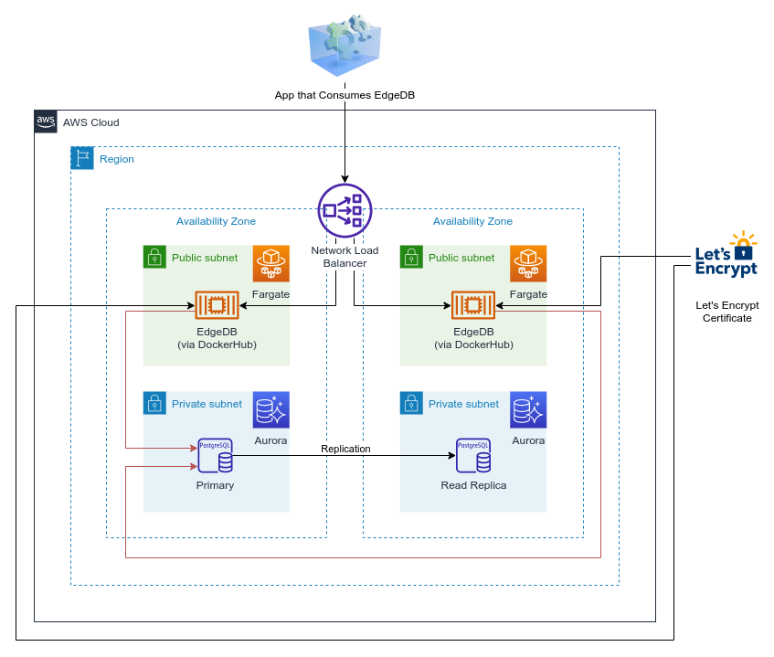

# cdk-edgedb



## Usage (within a CDK Application)

If you're not familiar with using AWS CDK to build on AWS, please check out the following resources:

- https://aws.amazon.com/cdk/
- https://cdkworkshop.com/

This CDK construct can be added to your CDK application by installing it from NPM:

```
npm install cdk-edgedb
```

### Using custom domain and public CA (Let's Encrypt) signed TLS certificate

Where `hostedZoneId` and `zoneName` match a domain that exists within your AWS account as a Route53 hosted zone.

```
import * as edgedb from 'cdk-edgedb';
...
const edgeDB = new edgedb.EdgeDB(this, 'EdgeDB', {
    customDomain: {
        hostedZoneId: 'ZRZFDEAGRDZ0K',
        zoneName: 'yourdomain.com',
        name: 'edgedb.yourdomain.com',
        email: 'yourname@emailprovider.com',
    },
});
```

See [API.md](./API.md)